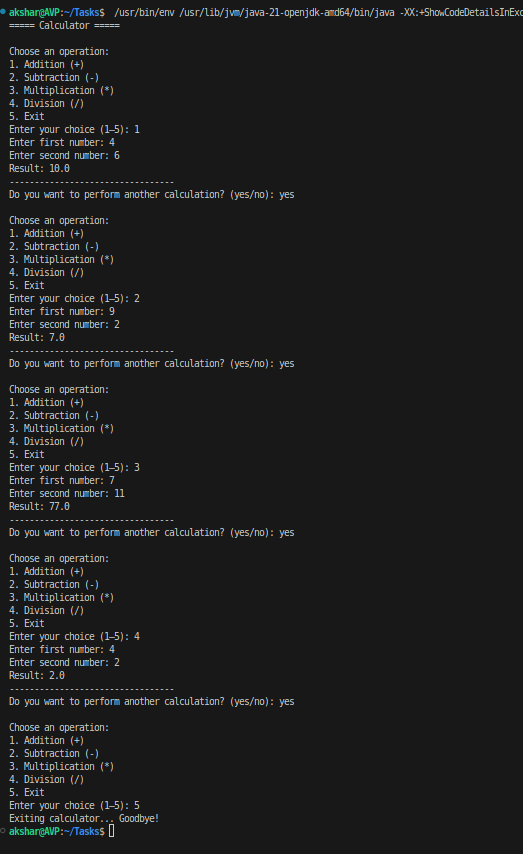

# Java Console Calculator

## Project Description
The **Java Console Calculator** is a simple yet powerful command-line application built to perform basic mathematical operations such as **addition**, **subtraction**, **multiplication**, and **division**.  

It is an interactive console-based program that takes user input, performs the requested calculation, and displays the result.  
The calculator continues to run in a loop until the user chooses to exit — providing a smooth and user-friendly experience.

This project was created to demonstrate a clear understanding of **Java programming fundamentals**, including:
- Method creation and usage
- Conditional statements (`if-else`, `switch-case`)
- Loops (`while`)
- User input handling using `Scanner`
- Basic arithmetic operations and logical flow

---

## Core Logic
- Each mathematical operation is implemented as a **separate method** to make the code modular and easy to maintain.
- The **`switch` statement** decides which method to call based on user input.
- A **`while` loop** ensures the calculator runs repeatedly until the user decides to stop.
- **Division by zero** is handled carefully to prevent runtime errors and provide a meaningful error message.

---

## Example Output Screenshot
